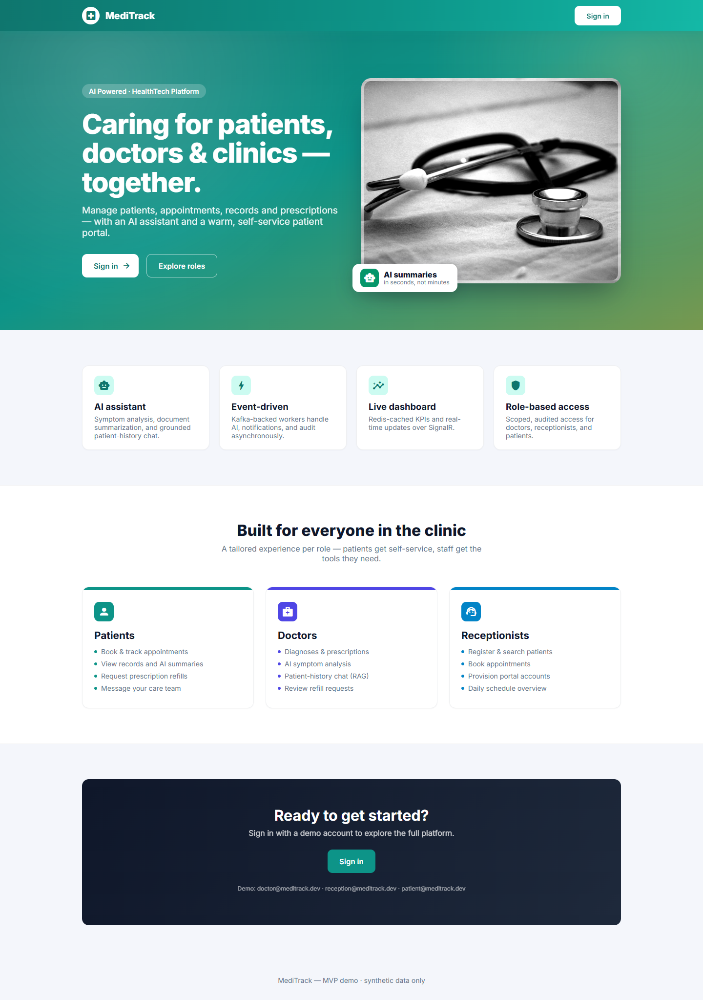
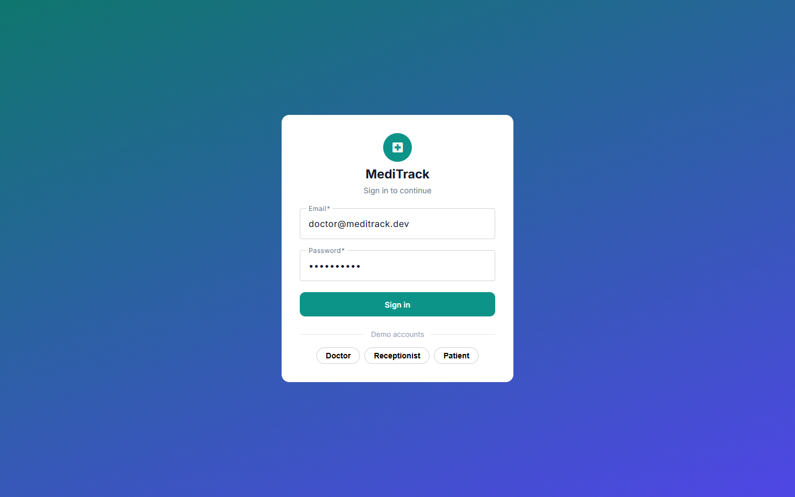
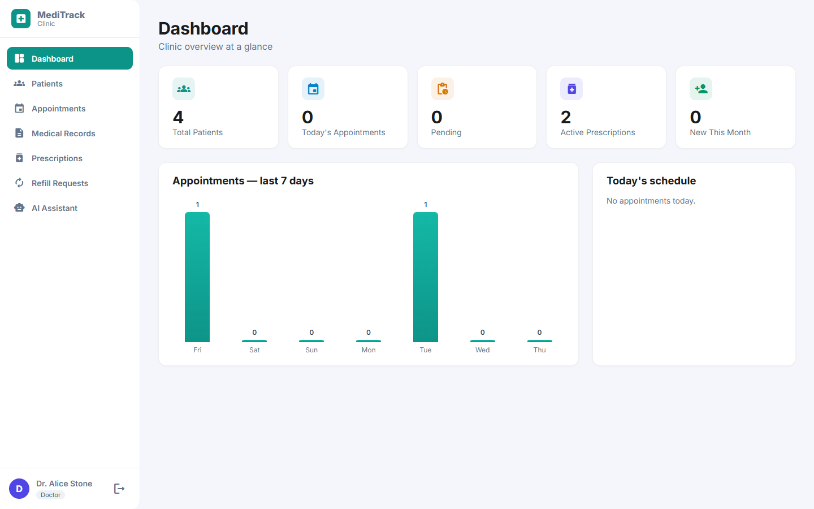
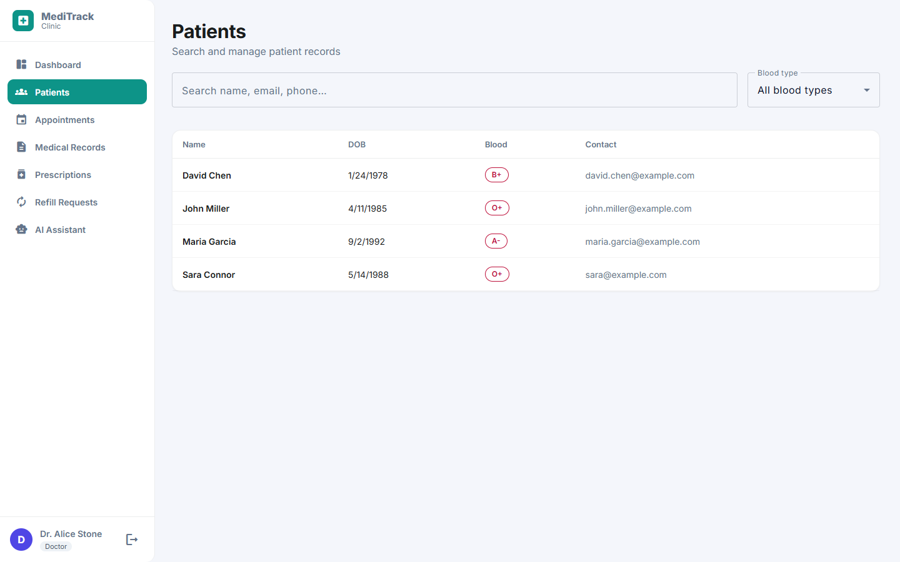
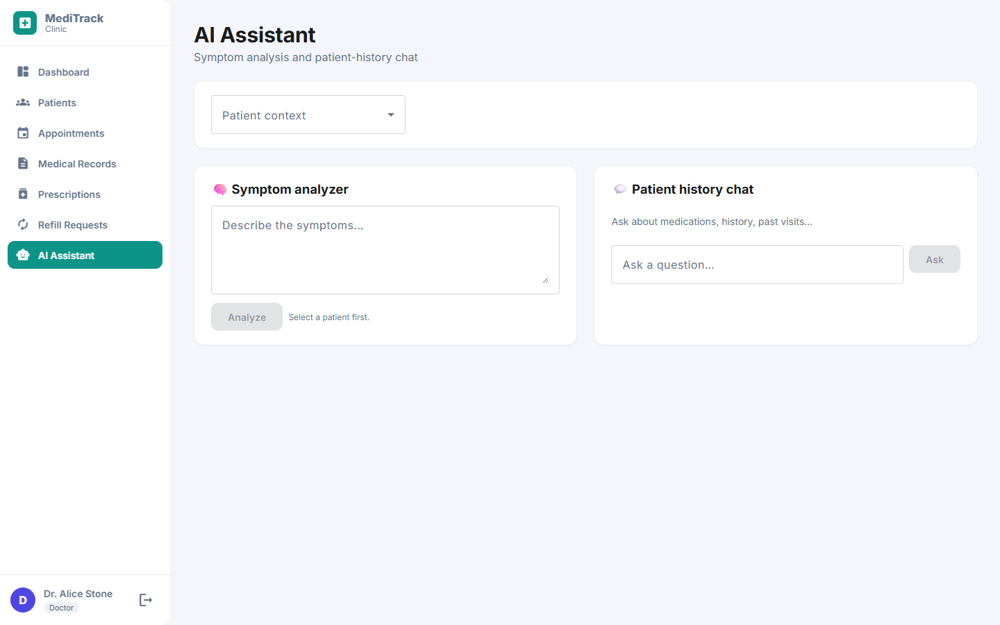
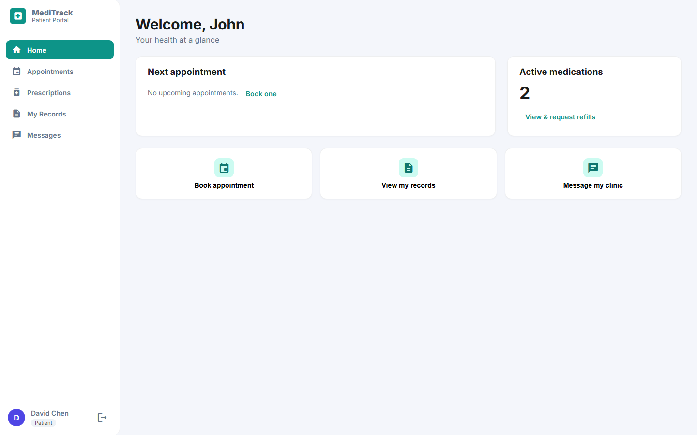
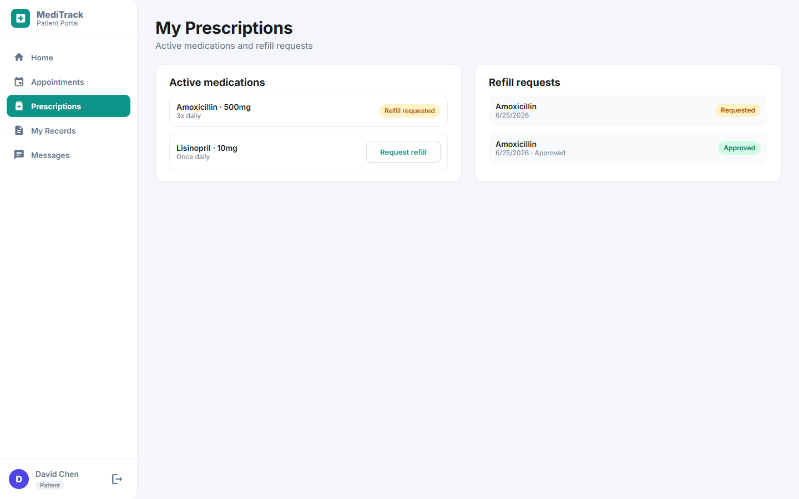

# 🏥 MediTrack — Full-Stack MVP

Event-driven Patient & Health Records platform. **.NET 9 · Clean Architecture · PostgreSQL · Redis · Kafka · AI · Next.js 16 + MUI.**

> ⚠️ MVP uses **synthetic/seed data only**. No real patient data (PHI). HIPAA/BAA compliance is deferred (see `app-idea.md`).

## Screenshots

> App UI captured against live seed data. The Next.js (`frontend/`) and Angular (`frontend-angular/`) builds are feature-equivalent and share the same teal design system.

### Landing & sign-in

| Landing page | Sign in |
| --- | --- |
|  |  |

### Clinic app (doctor / receptionist)

| Dashboard | Patients |
| --- | --- |
|  |  |

| AI assistant — symptom analysis + patient-history chat |
| --- |
|  |

### Patient portal

| Home | Prescriptions & refills |
| --- | --- |
|  |  |

## Architecture

```
Next.js 16 (web)  ──►  ASP.NET Core API  ──►  PostgreSQL (EF Core)
   ▲                       │   │   │
   └─ SignalR (realtime) ──┤   │   └─►  Redis  (cache, refresh tokens, SignalR backplane)
                           │   └─────►  Kafka  ──►  Workers (AI summary · Notifications · Audit)
                           └─────────►  Object storage (local disk in MVP)
```

Projects (`src/`):
| Project | Role |
|---|---|
| `MediTrack.Domain` | Entities + enums |
| `MediTrack.Application` | DTOs, service interfaces + implementations, validators, event contracts, stored-proc calls |
| `MediTrack.Infrastructure` | EF Core (+ 5 stored procedures), Redis, Kafka producer + consumer base, AI provider, auth, file storage |
| `MediTrack.Api` | Controllers, JWT/RBAC, SignalR hub + real-time consumer, rate limiting, health checks, OpenTelemetry, Swagger |
| `MediTrack.Workers` | Kafka consumers: AI summarizer, notifications, audit persistence |
| `tests/MediTrack.Tests` | xUnit unit tests (services + validators) |
| `frontend/` | Next.js 16 (App Router) + TypeScript + Material UI + Tailwind v4 + React Query + Zustand + MUI X Charts + SignalR |
| `frontend-angular/` | Angular 20 (standalone + signals) + Angular Material + Tailwind v3 + TanStack Angular Query + SignalR — a feature-equivalent port of `frontend/` |

### Feature highlights
- **Patient self-service portal**: patients view their own profile, appointments, prescriptions, and AI-summarized records; **self-book appointments**, **request prescription refills**, and **message the clinic** — all scoped to the logged-in patient (staff endpoints return 403).
- **Clinic-side portal management**: receptionists **provision patient portal accounts**; staff triage **refill requests** (doctors approve/deny with notes) and reply to patient **message threads**.
- **Appointment workflow**: status transitions (Scheduled → Checked-in → Completed / Cancelled / No-show), diagnosis recording, and prescription creation from an appointment.
- **Medical records**: document upload (≤20 MB) with async AI summarization; original files stream back on demand for both staff and the owning patient.
- **Dashboard**: 5 KPI tiles + 7-day appointment trend chart + today's schedule.

### Backend hardening included
- **Stored procedures** (Postgres functions): dashboard stats, patient search, today's appointments, patient history, active prescriptions
- **Real-time**: AI worker → Kafka (`medical-record.summarized`) → API consumer → SignalR push ("summary ready") with Redis backplane; clients subscribe per-patient via the hub
- **Resilience**: Polly standard handler on the AI client; Kafka retry + dead-letter (`<topic>.dlq`)
- **Rate limiting** on AI endpoints (10/min); **deep health checks** (Postgres/Redis/Kafka); **OpenTelemetry** tracing + metrics
- **Immutable audit trail**: sensitive access/mutations are published to Kafka and persisted by the audit worker

## Prerequisites
- .NET SDK 9 (targets `net9.0`)
- Docker Desktop

## Run

```bash
# 1. Start infrastructure (Postgres :5433, Redis :6379, Kafka :9092)
docker compose up -d

# 2. Start the API (auto-applies migrations + seeds on first run)
dotnet run --project src/MediTrack.Api
#    Swagger UI:  http://localhost:5293/swagger

# 3. Start the workers (separate terminal)
dotnet run --project src/MediTrack.Workers

# 4. Start the frontend (separate terminal)
cd frontend && npm install && npm run dev
#    App UI:  http://localhost:3000  (polished MUI theme + role-aware landing page)
```

## Run tests
```bash
dotnet test          # 9 unit tests (services + validators)
```

> Postgres is mapped to host port **5433** (host 5432 is commonly taken by a native Postgres install).
> Connection strings use **127.0.0.1** (not `localhost`) to force IPv4 to the Docker containers.

## Seeded logins
| Role | Email | Password | Lands on |
|---|---|---|---|
| Doctor | `doctor@meditrack.dev` | `Doctor123!` | Clinic app |
| Receptionist | `reception@meditrack.dev` | `Reception123!` | Clinic app |
| **Patient** | `patient@meditrack.dev` | `Patient123!` | **Patient Portal** |

The app opens on a **role-aware landing page** (`/`). After login it branches on role: patients get the self-service **Patient Portal** (`/portal/*`); staff get the clinic app (`/dashboard`, `/patients`, …). Patients can only access their own data — staff API endpoints return 403.

## Frontend pages
| Area | Route | What's there |
|---|---|---|
| Shared | `/` · `/login` | Role-aware landing · login |
| Clinic | `/dashboard` | 5 KPI tiles + 7-day appointment trend chart + today's schedule |
| Clinic | `/patients` · `/patients/[id]` | Search (with blood-type filter) · profile, history, prescriptions, records, AI summary, messaging |
| Clinic | `/appointments` · `/appointments/[id]` | Today's schedule + booking · status changes, diagnosis, prescriptions |
| Clinic | `/prescriptions` · `/records` | Prescription management · record upload with AI-summary status (Processing → Ready/Failed) |
| Clinic | `/refill-requests` | Triage pending refills (approve/deny with notes) |
| Clinic | `/ai` | Symptom analyzer (urgency + conditions + suggested tests) and patient-history chat |
| Portal | `/portal` | Next appointment, active medication count, quick links |
| Portal | `/portal/appointments` · `/portal/prescriptions` | View + self-book · view meds + request refills |
| Portal | `/portal/records` · `/portal/messages` | Records with AI summaries (read-only) · secure messaging with the clinic |

## Key endpoints

> "Staff" = Doctor **and** Receptionist. Patient-only routes live under `/api/portal`.

**Auth**
| Method | Route | Role |
|---|---|---|
| POST | `/api/auth/login` · `/api/auth/refresh` | anon |

**Clinic app (staff)**
| Method | Route | Role |
|---|---|---|
| GET | `/api/patients?search=&bloodType=&page=&pageSize=` | Staff |
| POST · PUT | `/api/patients` · `/api/patients/{id}` | Receptionist |
| GET | `/api/patients/{id}/appointments` · `/prescriptions` · `/records` | Staff |
| POST | `/api/patients/{id}/account` (provision portal login) | Receptionist |
| GET | `/api/appointments/today?doctorId=` · `/api/appointments/{id}` | Staff |
| POST | `/api/appointments` | Receptionist |
| PUT | `/api/appointments/{id}/diagnosis` | Doctor |
| PUT | `/api/appointments/{id}/status` | Staff |
| POST | `/api/prescriptions` | Doctor |
| POST | `/api/medical-records` (multipart upload) | Doctor |
| GET | `/api/medical-records/{id}/file` (download) | Staff |
| GET | `/api/doctors` | Staff |
| GET | `/api/dashboard/stats` | Staff (Redis-cached) |
| GET · PUT | `/api/refill-requests` · `/api/refill-requests/{id}` | Staff · Doctor |
| GET · POST | `/api/patients/{id}/messages` | Staff |
| POST | `/api/ai/analyze-symptoms` · `/api/ai/patients/{id}/chat` | Doctor |

**Patient portal (`/api/portal`, Patient role — own data only)**
| Method | Route |
|---|---|
| GET | `/me` · `/doctors` |
| GET · POST | `/appointments` (view · self-book) |
| GET | `/prescriptions` · `/records` · `/records/{id}/file` |
| GET · POST | `/refills` (view · request refill) |
| GET · POST | `/messages` (view thread · send to clinic) |

**Realtime**
| Method | Route | Role |
|---|---|---|
| WS | `/hubs/notifications` (`SubscribeToPatient` / `UnsubscribeFromPatient`) | authenticated |

## AI provider
Defaults to a **deterministic stub** (`Ai:Provider = "stub"`) so the system runs with no API key.
Set `Ai:Provider = "openai"`, `Ai:ApiKey`, `Ai:Model` to use a real LLM.

## Event flow (Kafka)
| Topic | Producer → Consumer |
|---|---|
| `meditrack.medical-record.uploaded` | API → AI summary worker |
| `meditrack.medical-record.summarized` | AI summary worker → API realtime consumer → SignalR |
| `meditrack.symptom-analysis.requested` | API → AI worker |
| `meditrack.appointment.booked` | API → Notification worker |
| `meditrack.audit.event` | API → Audit worker (persists immutably) |
| `meditrack.prescription.created` | API → (audit) |

## EF migrations
```bash
dotnet ef migrations add <Name> --project src/MediTrack.Infrastructure --startup-project src/MediTrack.Infrastructure --output-dir Persistence/Migrations
```
